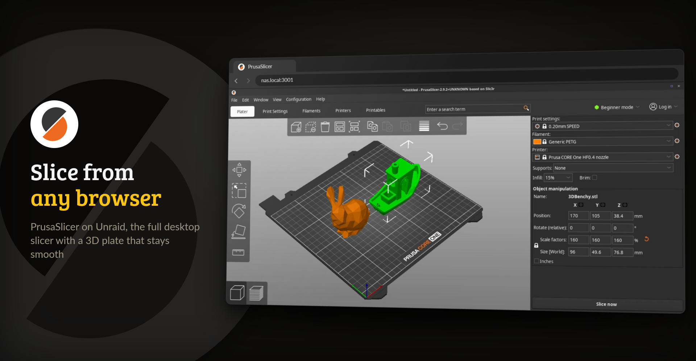
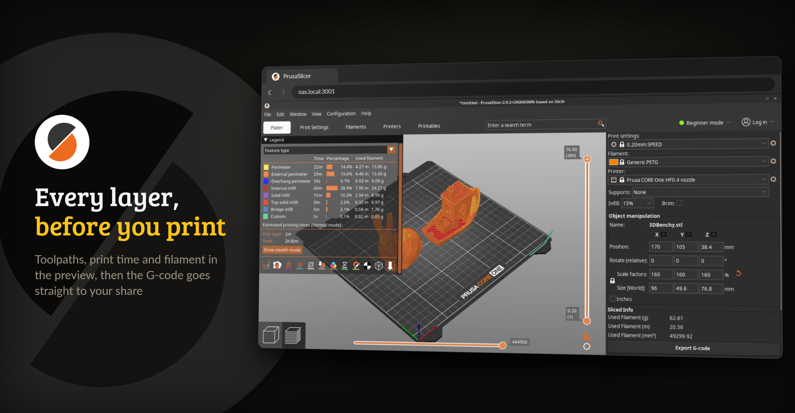

<p align="center">
  <picture>
    <source media="(prefers-color-scheme: dark)" srcset="https://raw.githubusercontent.com/junkerderprovinz/prusaslicer/main/.github/assets/prusaslicer-banner-dark.png">
    
  </picture>
</p>

<p align="center">
  <a href="https://github.com/junkerderprovinz/prusaslicer/actions/workflows/build.yml"></a>&nbsp;
  <a href="https://github.com/junkerderprovinz/prusaslicer/actions/workflows/lint.yml"></a>&nbsp;
  <a href="https://hub.docker.com/r/junkerderprovinz/prusaslicer"></a>&nbsp;
  <a href="https://hub.docker.com/r/junkerderprovinz/prusaslicer"></a>&nbsp;
  <a href="https://github.com/junkerderprovinz/prusaslicer/pkgs/container/prusaslicer"></a>&nbsp;
  <a href="https://github.com/prusa3d/PrusaSlicer"></a>&nbsp;
  <a href="https://ca.unraid.net/apps/prusaslicer-0118v4d0mxjg49"></a>&nbsp;
  <a href="LICENSE"></a>
</p>

<p align="center">
<b>PrusaSlicer, in your browser.</b> Slice from any device. No VNC client, no local install.<br>
This runs the full PrusaSlicer desktop app inside a single container and streams it to your
browser over <a href="https://github.com/selkies-project/selkies">Selkies</a> (H.264 video), so the
3D plate stays smooth to rotate, zoom and drag, the part of slicing where the old noVNC
containers feel laggy.
</p>

<!-- download-buttons: written by scripts/gen_download_buttons.py -->
<p align="center">
  <a href="https://ca.unraid.net/apps/prusaslicer-0118v4d0mxjg49"></a>
  &nbsp;
  <a href="https://hub.docker.com/r/junkerderprovinz/prusaslicer/"></a>
  &nbsp;
  <a href="https://github.com/junkerderprovinz/prusaslicer/releases/latest"></a>
</p>
<!-- /download-buttons -->

<br>

<p align="center">
A one-knight job: I build it, keep it running, work through the issues and add what people ask for, until nothing is missing. It is free, with no accounts, no telemetry, no ads and no paid tier. No asterisk anywhere. Nothing readable ever leaves your own walls. Forged on evenings and weekends, with heart and stubbornness.
</p>

<p align="center">
If it has earned a place on your server or computer, toss a coin to your knight: it helps cover the costs and keeps the project alive. It also makes this knight's heart beat a little faster. Three ways below, whichever suits you.
</p>

<!-- give-buttons: written by scripts/gen_download_buttons.py -->
<p align="center">
  <a href="https://buymeacoffee.com/junkerderprovinz"></a>
  &nbsp;
  <a href="https://www.paypal.com/donate/?hosted_button_id=76FVV52TKXTUS"></a>
  &nbsp;
  <a href="https://junkerderprovinz.github.io/junkerderprovinz/"></a>
</p>
<!-- /give-buttons -->

<br>

## Table of Contents

1. [What it looks like](#1-what-it-looks-like)
2. [What it does](#2-what-it-does)
3. [Getting started](#3-getting-started)
4. [How AI is used here](#4-how-ai-is-used-here)
5. [Support this project](#5-support-this-project)

<br>

## 1. What it looks like

The models in these pictures are the 3DBenchy and the bunny from PrusaSlicer's own shape gallery, sliced in a test container.

<p align="center">
  
  <br><em>The plater: place, scale and arrange models on the 3D build plate, right in your browser</em>
</p>

<p align="center">
  
  <br><em>The sliced preview: toolpaths by feature, print time and filament, then export the G-code</em>
</p>

<br>

## 2. What it does

- **The full PrusaSlicer desktop app** in a single container, for amd64 and arm64. No X client, no VNC viewer and nothing to install on your workstation.
- **Selkies instead of noVNC.** The desktop arrives as H.264 video, so rotating, zooming and dragging on the 3D plate stays smooth, which is where the old noVNC containers lag. A GPU on the host is used when there is one, and software rendering takes over when there is not.
- **PrusaSlicer from Debian trixie's `prusa-slicer` package**, since Prusa no longer ships a Linux AppImage, so it gets Debian's security updates and runs natively on both architectures.
- **Profiles that persist.** Printer, filament and print profiles live in `/config`, and closing PrusaSlicer starts a fresh one instead of leaving a black screen.

<br>

## 3. Getting started

On Unraid, install PrusaSlicer from [Community Applications](https://ca.unraid.net/apps/prusaslicer-0118v4d0mxjg49). Map your models and G-code folder to `/storage` (the template uses `/mnt/user`, which reaches all shares), then open the WebUI on the HTTPS port, `3001` by default.

Without Unraid:

```bash
docker run -d --name prusaslicer --shm-size=1gb \
  -p 3001:3001 \
  -e PUID=99 -e PGID=100 \
  -v /path/to/appdata/prusaslicer:/config \
  -v /path/to/models:/storage \
  junkerderprovinz/prusaslicer:latest
```

Open `https://<server-ip>:3001/` and accept the self-signed certificate once. On the first launch the Configuration Assistant asks for your printers and filaments. After that, import a model with File → Import, slice it and export the G-code into `/storage`.

> [!NOTE]
> The WebUI has no login by default, for use on a trusted network. Never expose it to the internet directly: put it behind a VPN or a reverse proxy with authentication, or set `CUSTOM_USER` and `PASSWORD` to turn on the built-in login.

<br>

## 4. How AI is used here

One knight builds this, and AI is one of the tools I work with, the same way I work with an editor or a compiler. It helps me write code and documentation and it checks my work, and that saves me a good many evenings. It does not make the decisions, though. I read and understand everything before it ships, and if something here breaks, that is on me and not on the tool.

You do not have to take my word for it. The code is open and every release note is written by hand. The issue tracker shows how problems actually get handled, including the ones I got wrong the first time. If you find something that is not right, open an issue and I will look at it.

<br>

## 5. Support this project

Questions, bugs, ideas or feature requests? Please [open a GitHub issue](https://github.com/junkerderprovinz/prusaslicer/issues).

A one-knight job: I build it, keep it running, work through the issues and add what people ask for, until nothing is missing. It is free, with no accounts, no telemetry, no ads and no paid tier. No asterisk anywhere. Nothing readable ever leaves your own walls. Forged on evenings and weekends, with heart and stubbornness.

If it has earned a place on your server or computer, toss a coin to your knight: it helps cover the costs and keeps the project alive. It also makes this knight's heart beat a little faster. Three ways below, whichever suits you.

<!-- give-buttons: written by scripts/gen_download_buttons.py -->
<p align="center">
  <a href="https://buymeacoffee.com/junkerderprovinz"></a>
  &nbsp;
  <a href="https://www.paypal.com/donate/?hosted_button_id=76FVV52TKXTUS"></a>
  &nbsp;
  <a href="https://junkerderprovinz.github.io/junkerderprovinz/"></a>
</p>
<!-- /give-buttons -->

<br>

<sub>The packaging in this repository is AGPL-3.0. PrusaSlicer by Prusa Research is AGPL-3.0 as well, and this project is not affiliated with or endorsed by Prusa Research. Every bundled component and its licence is listed in <a href="NOTICE">NOTICE</a>.</sub>
